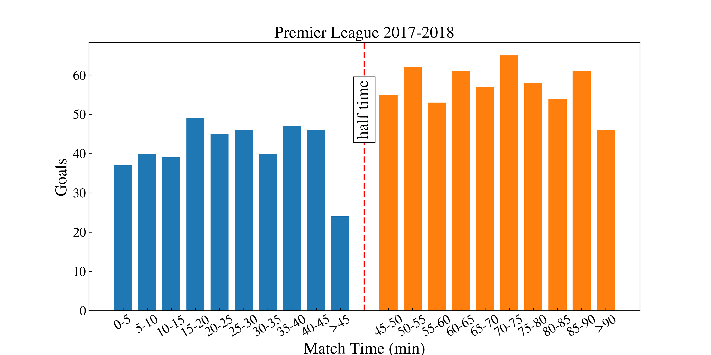

# Soccer Analytics with Python
This is a repo to present examples of soccer analytics using Python made by myself. The datasets are collected from open datasets published freely online.

## Database
- `Wyscout`: spatial-temporal match events for the entire 2017-2018 season of the top league in England, Frence, Germany, Italy and Spain, the European Champions League, and the 2018 FIFA World Cup. [Link](https://www.nature.com/articles/s41597-019-0247-7).

## Notebooks
- `score_time.ipynb` : analyses if scoring time is random or not ? 

