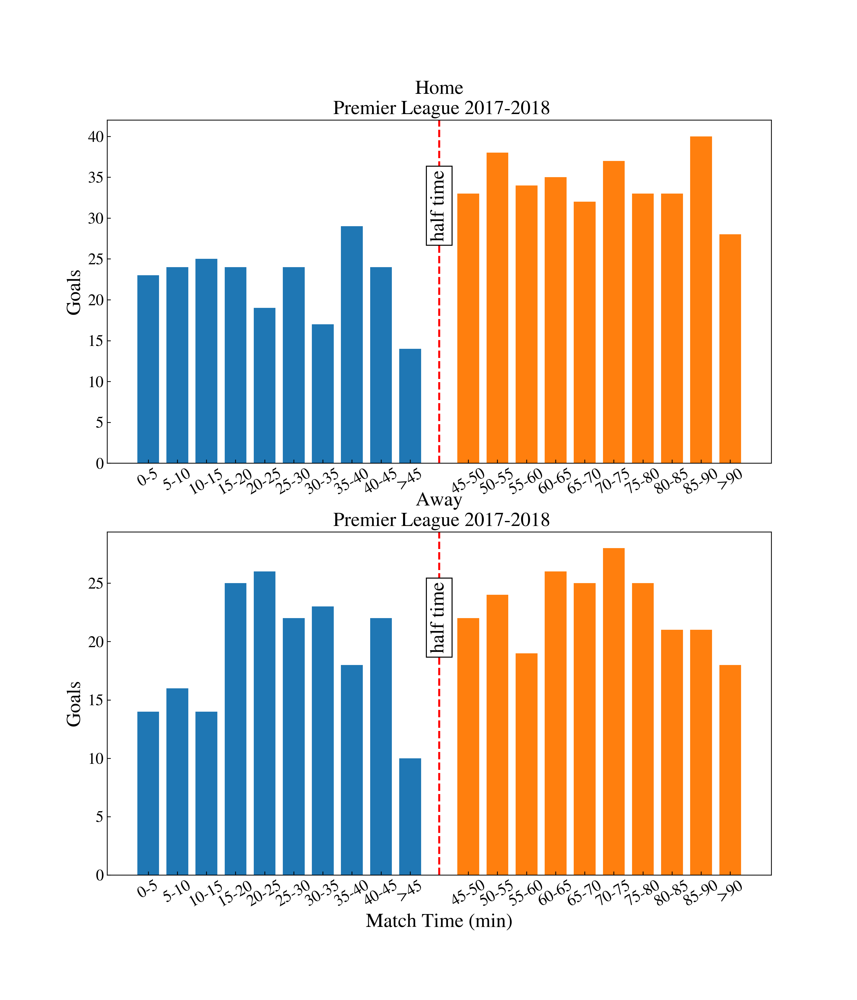
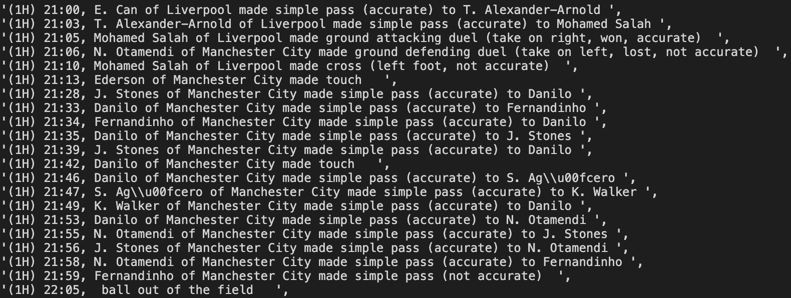

# Soccer Analytics with Python
This is a repo to present examples of soccer analytics using Python made by myself. The datasets are collected from open datasets published freely online.

## Notebooks
- `score_time.ipynb` : is scoring time in a match random or not ?

- `narrative_generator.ipynb` : generate narratives from the events data

## Database
- `Wyscout`: spatial-temporal match events for the entire 2017-2018 season of the top league in England, Frence, Germany, Italy and Spain, the European Champions League, and the 2018 FIFA World Cup.
  - **Source**: Pappalardo, Luca; Massucco, Emanuele (2019): Soccer match event dataset. figshare. Collection. https://doi.org/10.6084/m9.figshare.c.4415000.v5.
  - **Reference**: Pappalardo, L., Cintia, P., Rossi, A. et al. A public data set of spatio-temporal match events in soccer competitions. Scientific Data 6, 236 (2019) doi:10.1038/s41597-019-0247-7, https://www.nature.com/articles/s41597-019-0247-7.

